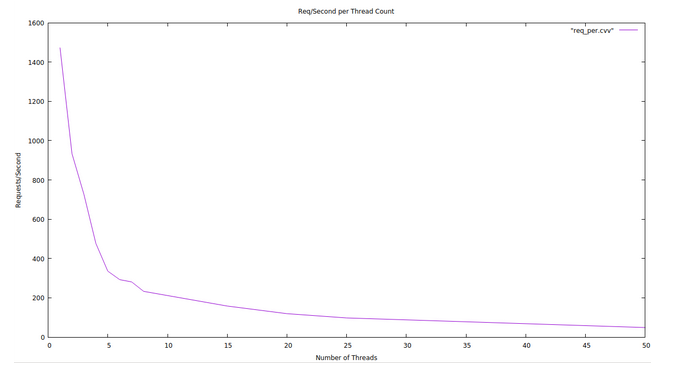
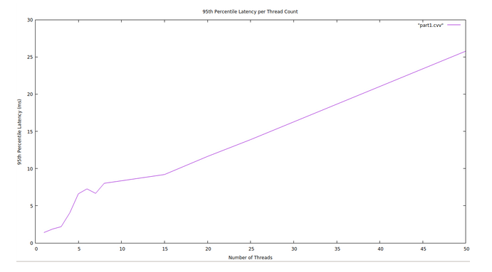
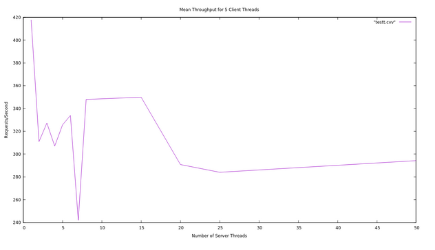
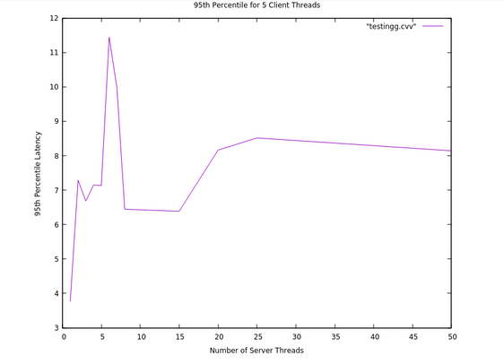

# HW6: Crank it up!
Ian Jackson, Arthur Lawson

## Part 1: Multithreaded benchmark

The graphs (Figure 1, Figure 2) below show what testing was done after implementing mulithreading into our baseline.cc file. From the requests per second plot (Figure 1), we observed a threshold of around 10 threads where the growth went from exponential to linear. This is likely due to the bottleneck of the server, which was not yet multithreaded. From our 95th percentile latency tests (Figure 2), we observed a negative exponential inverse growth curve. This makes sense, since, as latency goes up, requests per second (most likely) goes down.

Figure 1

Figure 2

## Part 2: Multithreaded server

We had a bit more trouble finding as clean results from our mutithreaded implementation of the server. We decided to use 5 client threads as a constant for testing because we found that 5 was a comfortable median between the threshold of 10 (found in Part 1) and the minimum of 1 thread. Using the same threadcounts for testing the affect of changing the number of threads that the server ran resulted in a requests per second plot (Figure 3) that started high (around 420) and quickly dropped down to around 310, where it oscillated until spiking down again to around 240 at 6 threads. This jerky behavior made it pretty hard to determine the core effect of threadcount on the server side. The 94th percentile plot has one less local maximum, but is just as erratic in forme (Figure 4). The plot starts at around 3.9ms and spikes to 11.5ms at 7 threads, then stays between roughly 9ms and 7ms for the rest of the threadcounts tested. Interestingly, the two plots have a spike around the same number of threads (in the opposite direction as well, which vaguely argues for their correlation). More investigation of this potential relationship could reveal why our results aren't as clean as we'd hoped.

Figure 3

Figure 4

## Part 3: Optimization
To optimize the code, we used two main techniques. The first of these was to sprinkle const wherever we could. These ended up being mostly in the baseline.cc and benchmarks.cc files. Secondly, we preallocated space for each vector (using std::vector::reserve) so that they weren't dynamically reallocated throughout the run time. These changed were primarily made in the baseline.cc and cache_server.cc files.

## Leaks, Bugs, and Warnings!
We have encountered segmentation faults when the threadcount is too high, but a reasonable number of threads has been consistently working.

## Sources / Contributions
Multithreaded Beast Server from Vinnie Falco's advanced server example code: https://www.boost.org/doc/libs/1_73_0/libs/beast/example/advanced/server/advanced_server.cpp
